<a href="https://mahditalal.com"><picture><source media="(prefers-color-scheme: dark)" srcset="./assets/hero-dark.svg"></picture></a>

I'm an AI Engineer at **Empire Media** in Beirut, Lebanon. I build autonomous AI coding pipelines (one has opened **200+ pull requests**) and production MCP servers, including a multi-tenant Google Workspace MCP server used by **15 people**. I'm available for freelance AI projects, and open to the right full-time role.

**[mahditalal.com](https://mahditalal.com)** · [Hire me](https://mahditalal.com/hire) · [LinkedIn](https://www.linkedin.com/in/mahdi-talal) · [X](https://x.com/mahditalal17) · [hello@mahditalal.com](mailto:hello@mahditalal.com)

<a href="https://mahditalal.com/work"><picture><source media="(prefers-color-scheme: dark)" srcset="./assets/proof-dark.svg"></picture></a>

<a href="https://mahditalal.com/work/autonomous-ai-coding-pipeline"><picture><source media="(prefers-color-scheme: dark)" srcset="./assets/card-pipeline-dark.svg"></picture></a> <a href="https://mahditalal.com/work/google-workspace-mcp-server"><picture><source media="(prefers-color-scheme: dark)" srcset="./assets/card-workspace-mcp-dark.svg"></picture></a>
<a href="https://mahditalal.com/work#remote-mcp-servers"><picture><source media="(prefers-color-scheme: dark)" srcset="./assets/card-remote-mcp-dark.svg"></picture></a> <a href="https://mahditalal.com/work#cvforge-ai"><picture><source media="(prefers-color-scheme: dark)" srcset="./assets/card-cvforge-dark.svg"></picture></a> <a href="https://mahditalal.com/work#quicky-delivery-dispatch-erp"><picture><source media="(prefers-color-scheme: dark)" srcset="./assets/card-quicky-dark.svg"></picture></a>

<a href="https://mahditalal.com/work/autonomous-ai-coding-pipeline"><picture><source media="(prefers-color-scheme: dark)" srcset="./assets/pipeline-dark.svg"></picture></a>

<a href="https://mahditalal.com/about"><picture><source media="(prefers-color-scheme: dark)" srcset="./assets/stack-dark.svg"></picture></a>

<a href="https://mahditalal.com/hire"><picture><source media="(prefers-color-scheme: dark)" srcset="./assets/cta-dark.svg"></picture></a>
