<a href="https://mahditalal.com">
  <picture>
    <source media="(prefers-color-scheme: dark)" srcset="./assets/header-dark.svg">
    
  </picture>
</a>

I'm an AI Engineer at **Empire Media** in Beirut, Lebanon. I build autonomous AI coding pipelines (one has opened **200+ pull requests**) and production MCP servers, including a multi-tenant Google Workspace MCP server used by **15 people**.

I'm available for freelance AI projects, and open to the right full-time role.

**[mahditalal.com](https://mahditalal.com)** · [Hire me](https://mahditalal.com/hire) · [LinkedIn](https://www.linkedin.com/in/mahdi-talal) · [X](https://x.com/mahditalal17) · [hello@mahditalal.com](mailto:hello@mahditalal.com)

 

| **200+** | **186** | **15** | **42** |
|:--|:--|:--|:--|
| pull requests opened by the Autonomous AI Coding Pipeline | tools across 12 Google services in one MCP server | people using the Google Workspace MCP Server | daily.dev tools in a remote MCP server |

## Selected work

### [Autonomous AI Coding Pipeline](https://mahditalal.com/work/autonomous-ai-coding-pipeline)
Label a GitHub issue and an agent plans, writes tests, codes and opens a pull request that gated AI reviewers check. It's built on GitHub Actions and Claude Code, and has opened 200+ pull requests across four company repositories, with TDD guardrails, bounded retry loops and gated review before every merge. 
`Claude Code` `GitHub Actions` `TypeScript` · **[How I built the Autonomous AI Coding Pipeline →](https://mahditalal.com/work/autonomous-ai-coding-pipeline)**

### [Google Workspace MCP Server](https://mahditalal.com/work/google-workspace-mcp-server)
One Claude connector that gives each employee isolated access to their own Google accounts. It's a remote, multi-tenant MCP server with a built-in OAuth 2.1 authorization server, exposing 186 tools across 12 Google services, used by 15 people at Empire Media. 
`MCP` `OAuth 2.1` `Multi-tenant` · **[How I built the Google Workspace MCP Server →](https://mahditalal.com/work/google-workspace-mcp-server)**

### [Remote MCP Servers: daily.dev & fal.ai](https://mahditalal.com/work#remote-mcp-servers)
Two remote MCP servers that give coding agents the daily.dev API (42 tools) and fal.ai image generation (11 tools) over Streamable HTTP.

### [CVForge AI](https://mahditalal.com/work#cvforge-ai)
An AI career platform: RAG-tailored CVs and cover letters, ATS scoring, application tracking and mock interviews, built on pgvector and BullMQ workers.

### [Quicky Delivery Dispatch ERP](https://mahditalal.com/work#quicky-delivery-dispatch-erp)
A Next.js and PostgreSQL ERP that replaced manual call-center dispatching with a fair driver queue and automated WhatsApp dispatch. It runs in production at Quicky.

**[All projects and case studies →](https://mahditalal.com/work)**

## How I build

- **Agents with hard guardrails.** Deterministic orchestration around LLM workers: bounded loops, hooks the agent can't edit and schema-typed handoffs.
- **Humans stay in charge.** Agents propose; people merge pull requests, answer clarifications and approve decisions.
- **Production MCP engineering.** Remote MCP servers with OAuth 2.1, per-tenant isolation and verified side effects.
- **Spec-first and documented.** PRDs with rejected alternatives, decision records and honest notes on what is verified versus assumed.

## Stack

**AI & agents:** Claude API · Claude Code · Model Context Protocol · OpenAI API · LangChain · pgvector · n8n

  

<picture>
  <source media="(prefers-color-scheme: dark)" srcset="https://raw.githubusercontent.com/Mahdi-Talal-01/mahdi-talal-01/output/github-contribution-grid-snake-dark.svg">
  
</picture>
